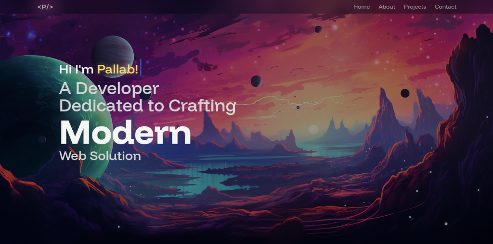
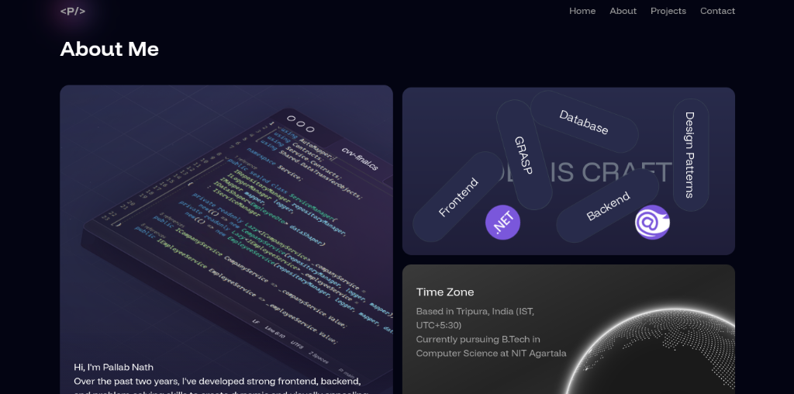
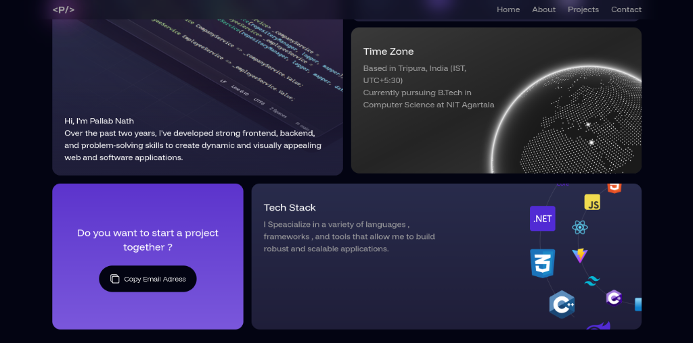
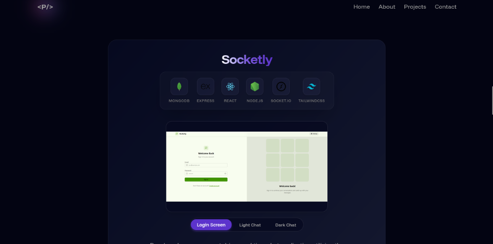
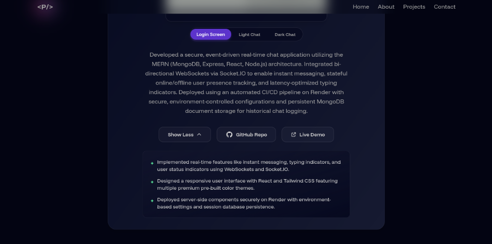
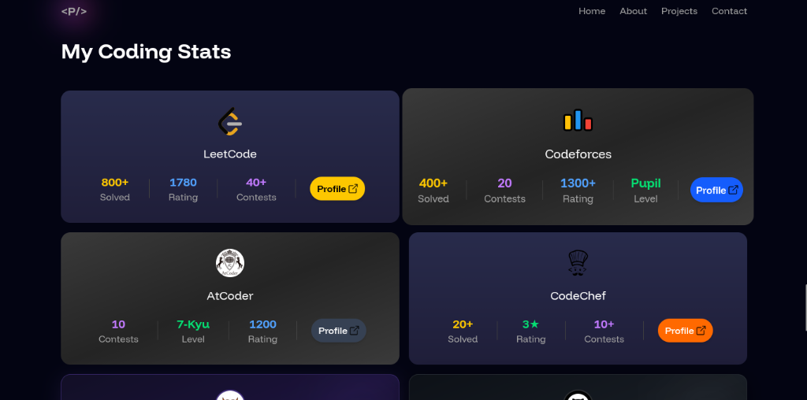
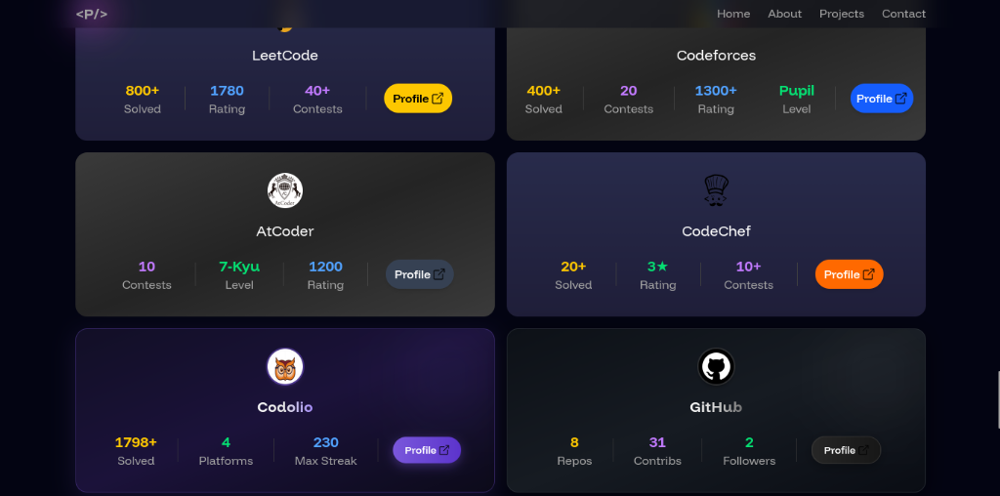
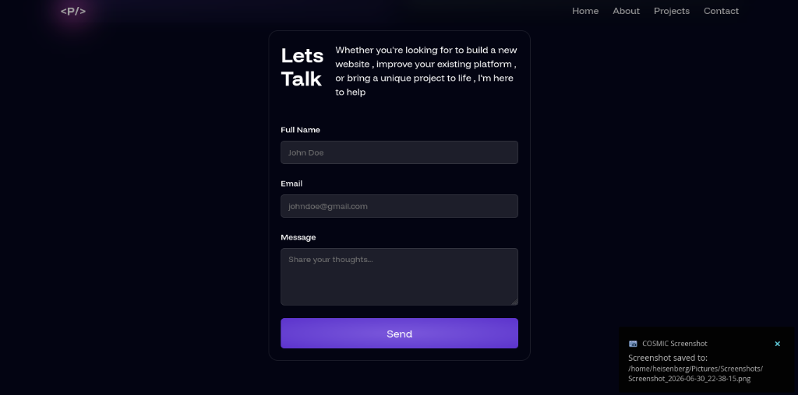

# 🌟 Pallab Nath's Portfolio Website

Welcome to my personal portfolio repository! This is a modern, fast, and visually stunning portfolio website built using **React 19**, **Vite**, **Tailwind CSS**, and **Framer Motion** (Motion). It is designed to showcase my skills, projects, and live coding statistics across various platforms.

---

## 📸 Website Highlights

Here are the key highlights and sections of the portfolio:

### 🚀 1. Hero & Landing Section
The main entry point of the website featuring clean navigation, animated floating terms, and a dynamic space/planet background.


### 👤 2. About Me Page
A highly interactive grid layout showing:
* A code snippet background illustration.
* A creative word cloud canvas representing key design philosophies (Database, GRASP, Design Patterns, OOP).
* Pursuit of B.Tech in Computer Science at NIT Agartala.


* Interactive "Copy Email Address" card to easily copy the email address.
* Custom technology node web showcasing active skills (.NET, React, C++, C#, JS, CSS3, etc.).


### 🛠️ 3. Projects Section
Showcase of personal projects with technical details. For example, **Socketly** (a secure real-time MERN chat app):
* Icon integrations of standard tools (MongoDB, Express, React, Node.js, Socket.IO, Tailwind CSS).
* Responsive mockup slide showcasing login screen and chat channels.


* Project description outlining MVC/MERN architecture, WebSocket integration, and latency-optimized typing indicators.
* Detailed feature bullet points and clickable links to "GitHub Repo" and "Live Demo".


### 📊 4. Coding Stats Section
A dashboard presenting coding metrics across popular platforms (LeetCode, Codeforces, AtCoder, CodeChef):


Now fully upgraded with dynamically fetched Codolio and GitHub statistics card layouts:


### ✉️ 5. Contact Me Section
A minimal, elegant contact form integrated with EmailJS for direct inquiries.


---

## ✨ Key Features

1. **Modern Premium Aesthetics**: Beautiful dark mode theme using rich custom gradients, glowing container borders, glassmorphism, and responsive grid layouts.
2. **Smooth Fluid Animations**: Leverage the power of **Motion (Framer Motion)** to create smooth layout transitions, cards scaling on hover, and fade-in scroll effects.
3. **Live Coding Statistics**:
   * **LeetCode**: Knights badge, 1000+ problems solved, 1890 peak rating.
   * **Codeforces**: Pupil level, 600+ solved problems, 1300+ rating.
   * **CodeChef**: 3★ rating, 1600+ peak rating.
   * **AtCoder**: 7-Kyu level, 1200 rating.
4. **Fully Dynamic Stats Integration**:
   * **GitHub API**: Automatically fetches live public repository count and followers.
   * **Codolio API**: Dynamically aggregates total questions solved across all linked platforms (LeetCode, Codeforces, CodeChef, GeeksforGeeks) and displays the maximum active coding streak.
   * *Built-in resilience allows the site to fall back to default statistics gracefully if network requests are rate-limited or offline.*
5. **Interactive Contact Form**: Configured with **EmailJS** to send messages directly from the website without needing a backend server.

---

## 🛠️ Built With

* **Frontend Framework**: [React 19](https://react.dev/)
* **Build Tool**: [Vite](https://vite.dev/)
* **CSS Framework**: [Tailwind CSS v4](https://tailwindcss.com/)
* **Animations**: [Motion (Framer Motion)](https://motion.dev/)
* **Email Service**: [EmailJS](https://www.emailjs.com/)

---

## 🚀 Getting Started

To run the project locally on your machine, follow these steps:

### Prerequisites
Make sure you have [Node.js](https://nodejs.org/) installed.

### Installation

1. Clone the repository:
   ```bash
   git clone https://github.com/He1senberg8/Portfolio.git
   cd Portfolio
   ```

2. Install the dependencies:
   ```bash
   npm install
   ```

3. Start the local development server:
   ```bash
   npm run dev
   ```

4. Build for production:
   ```bash
   npm run build
   ```
